# Movie ticket booking

This is movie ticket booking app. This project has written in clean architecture.
This is local database app. You can be admin and user in this app. Here you can login as admin and you can add movie tickets. 
Admin can add, delete, edit the tickets and an information.
User can book the tickets. 

## App contains

- Flutter Clean architecture
- State management: ChangeNotifier and ListenableBuilder
- DI get_it
- Routing: without any package used Navigator
- Floor database
- Local storage

---

## Features
 
 - Use the app as admin or user
 - Add the tickets to favorites
 - Remove the ticket from favorites
 - Booking the ticket
 - History of booked tickets
 - Clear the history
 - Dark and light theme
 - Select image

 -Admin:
 - Add tickets with information of movie
 - Delete the ticket
 - Edit the ticket data

---

## Screenshots:

<table>
  <tr>
    <td>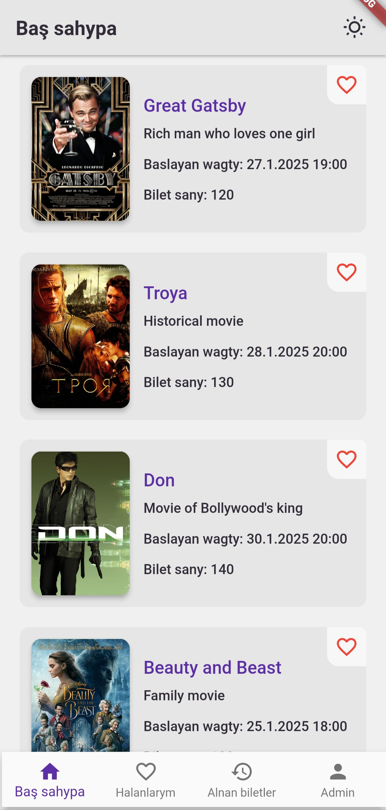</td>
    <td>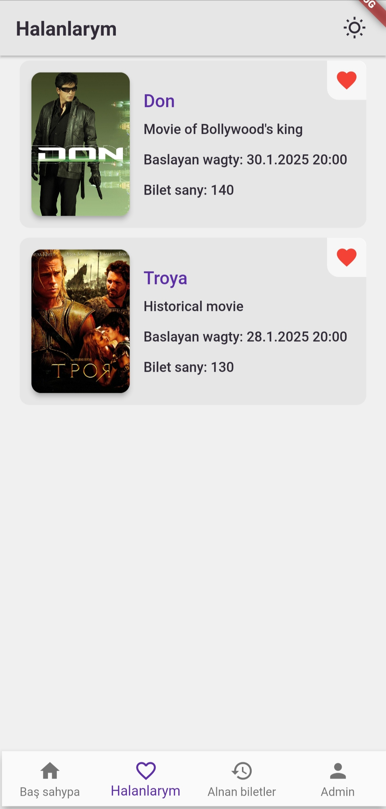</td>
  </tr>
  <tr>
    <td>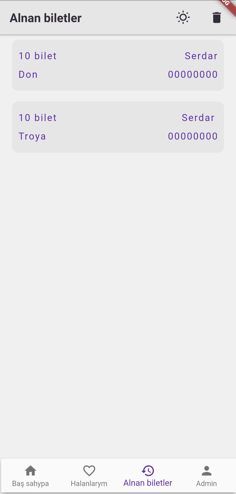</td>
    <td>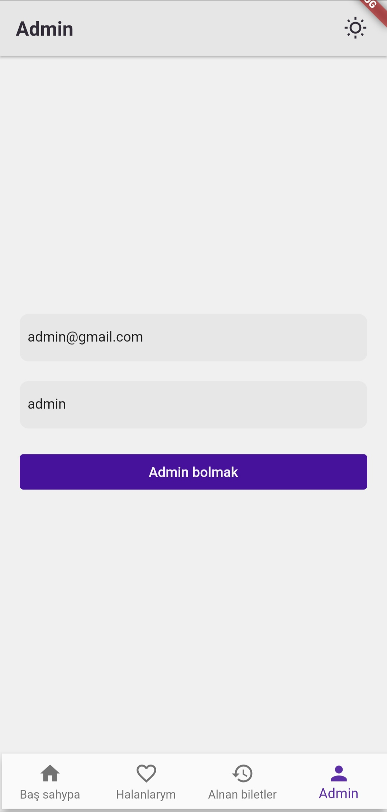</td>
  </tr>
  <tr>
    <td>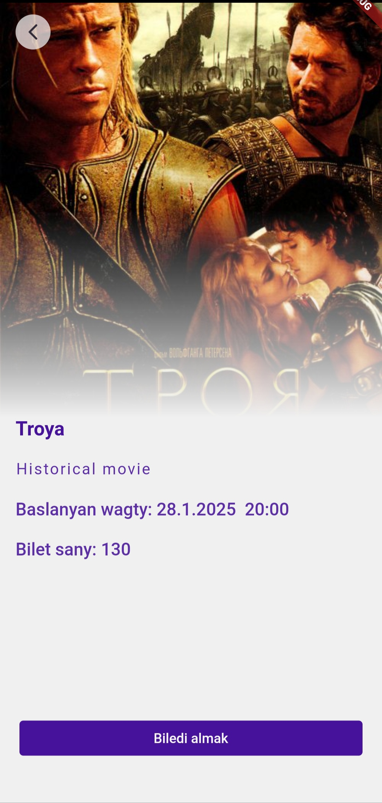</td>
    <td>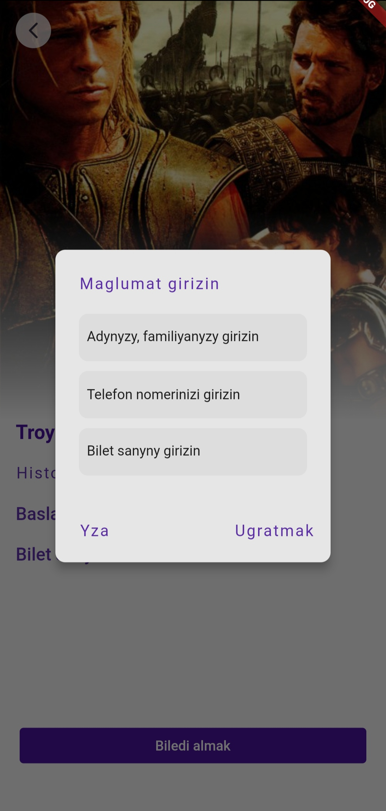</td>
  </tr>
  <tr>
    <td>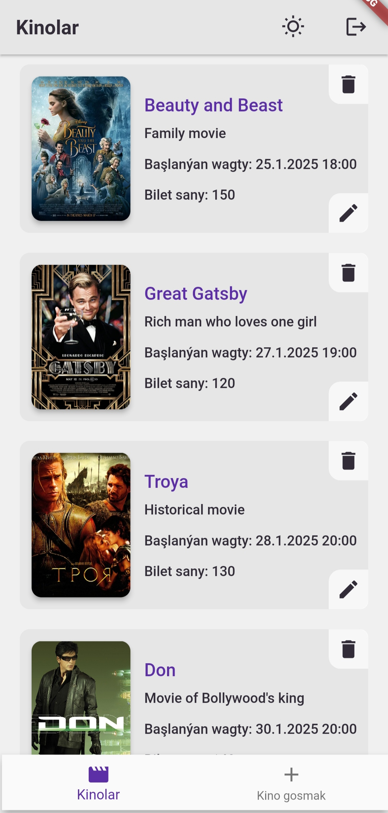</td>
    <td>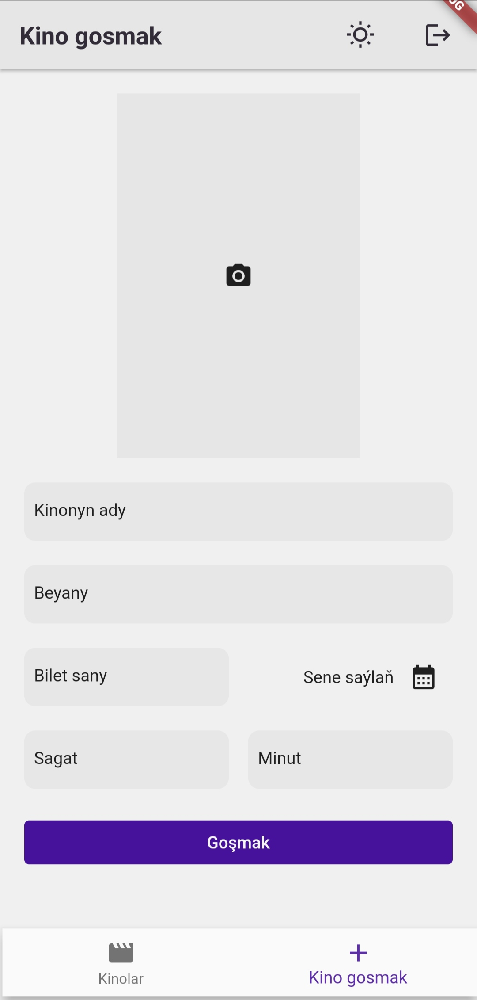</td>
  </tr>
  <tr>
    <td>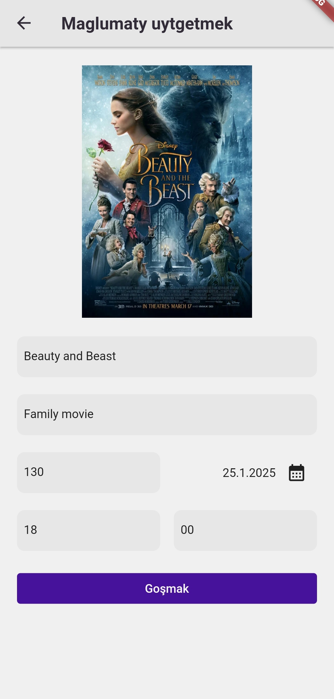</td>
  </tr>
</table>

---
<table>
  <tr>
    <td>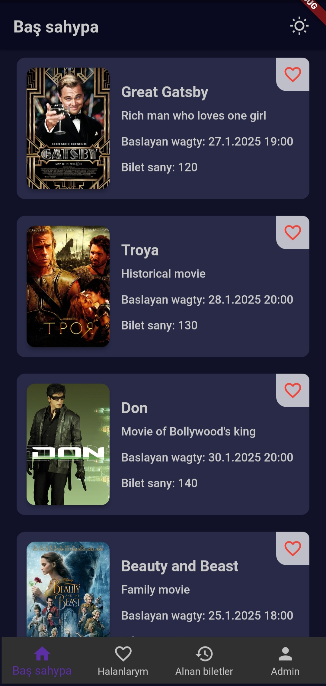</td>
    <td>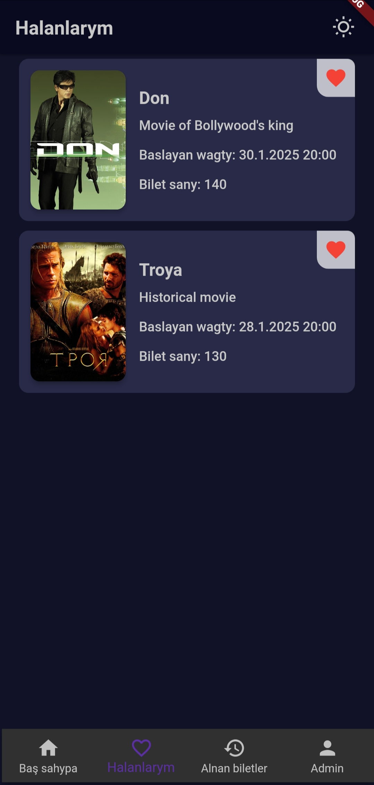</td>
  </tr>
  <tr>
    <td>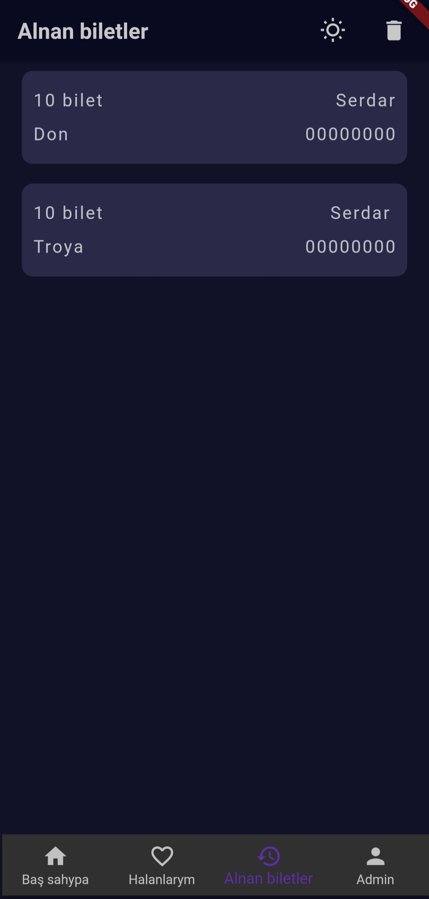</td>
    <td>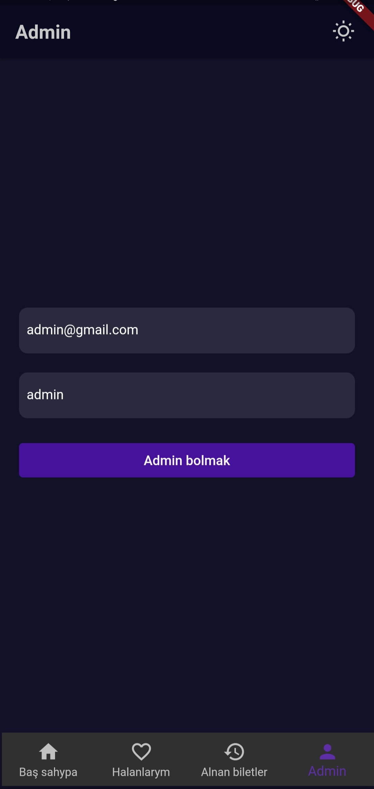</td>
  </tr>
  <tr>
    <td>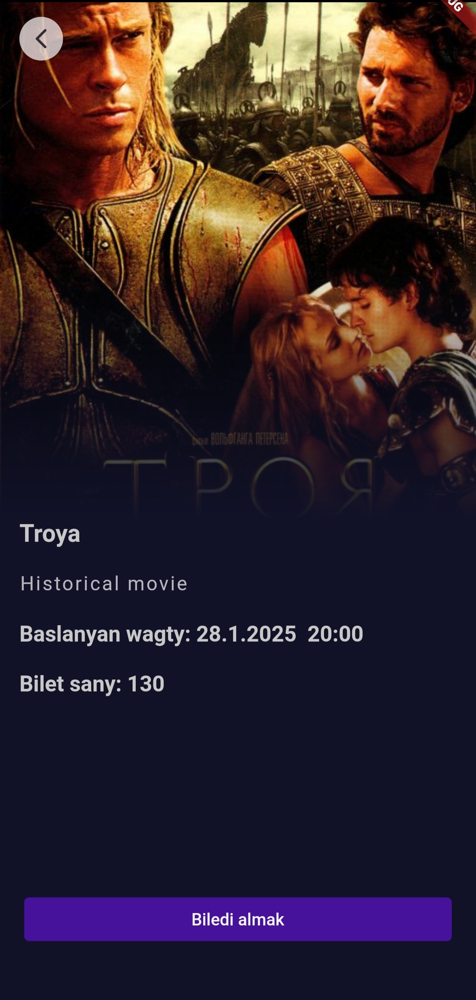</td>
    <td>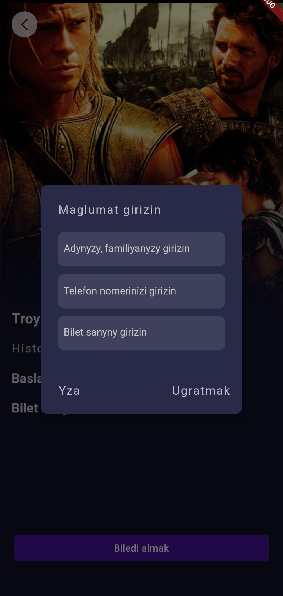</td>
  </tr>
  <tr>
    <td>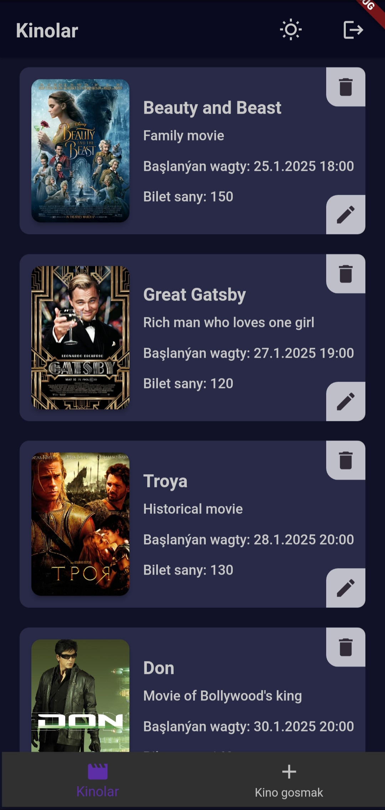</td>
    <td>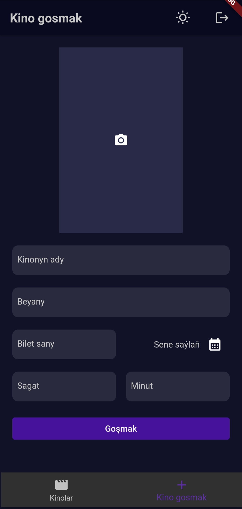</td>
  </tr>
  <tr>
    <td>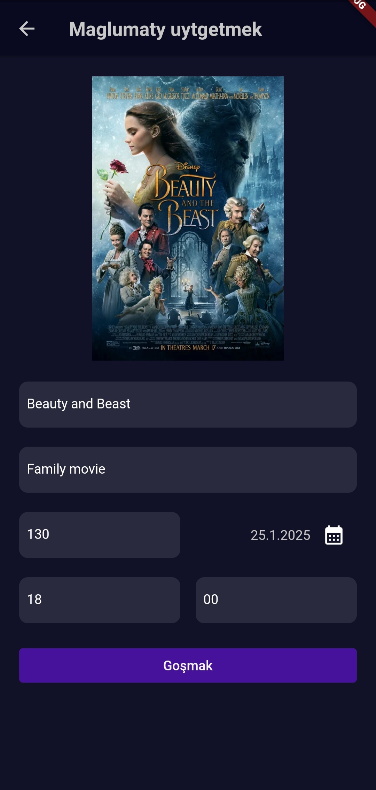</td>
  </tr>
</table>
